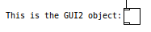

<h2>GUI demo objects</h2>

The GUI objects are intendend to demonstrate the structure of GUI-code for Pure Data.

GUI1 contains only the widget event structure, without any drawing on the canvas.

GUI2 adds an outline and inlet and outlet drawing on the canvas. Most events are logged to the console.

GUI3 is a simplified implementation of the comment object. It is as yet incomplete.

GUI4 is GUI2 but with zoom functionality (and some refactoring added)

GUI5 adds mouse control via the widgetbehaviour functionality (limited mouseup)

GUI6 adds better mouse control via the pd_bind proxy method

The original location of the Git repository is https://github.com/electrickery/pd-playground/tree/master/GUI

fjkraan@xs4all.nl, 2018-08-04

